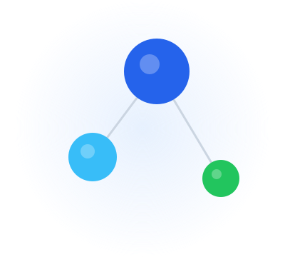

::: {.hero}
::: {.hero-inner}

::: {.hero-content}

```{=html}
<div class="status-pill">
  <span class="status-dot" aria-hidden="true"></span>
  Open to data analyst &amp; data engineering roles
</div>
```

[DATA ANALYST · DATA ENGINEERING · AI AUTOMATION]{.hero-eyebrow}

[Turning messy data into useful insights through Python, SQL, dashboards, automation, and AI-assisted analysis.]{.hero-tagline}

::: {.hero-cta}
[View Projects](projects/index.html){.btn-hero-primary}
[Contact Me](contact.html){.btn-hero-outline}
:::

:::

```{=html}
<div class="hero-visual" aria-hidden="true">
  
</div>
```

:::
:::

::: {.skill-strip}
[Python]{.skill-chip}
[SQL]{.skill-chip}
[Excel VBA]{.skill-chip}
[Power BI]{.skill-chip}
[Data Pipelines]{.skill-chip}
[pandas]{.skill-chip}
[Machine Learning]{.skill-chip}
[AI Agents]{.skill-chip}
:::

## Featured Projects {.section-heading}

::: {#featured-projects}
:::

## What I Build {.section-heading}

::: {.focus-grid}

::: {.focus-card}
### Data Analysis
Business analysis, SQL reporting, and Excel breakdowns that translate raw data into clear, decision-ready findings.
:::

::: {.focus-card}
### Data Engineering
ETL pipelines, database work, data cleaning, API collection, and automation that move data from messy to usable.
:::

::: {.focus-card}
### AI & Automation
AI agents, LLM tools, document analysis assistants, and AI-assisted Excel and SQL workflows for real business tasks.
:::

::: {.focus-card}
### Machine Learning
Supervised and unsupervised models, baselines, evaluation, and error analysis applied to real business problems.
:::

:::

## Skills {.section-heading}

::: {.skills-grid}

::: {.skill-group}
### Data Analysis
[Python]{.skill-chip} [SQL]{.skill-chip} [pandas]{.skill-chip} [Excel]{.skill-chip} [Statistics]{.skill-chip}
:::

::: {.skill-group}
### Dashboards & Reporting
[Power BI]{.skill-chip} [Tableau]{.skill-chip} [Excel VBA]{.skill-chip}
:::

::: {.skill-group}
### Data Engineering
[ETL]{.skill-chip} [Data Cleaning]{.skill-chip} [Data Pipelines]{.skill-chip} [APIs]{.skill-chip} [Databases]{.skill-chip}
:::

::: {.skill-group}
### Data Science & ML
[scikit-learn]{.skill-chip} [Hypothesis Testing]{.skill-chip} [Machine Learning]{.skill-chip} [AI Agents]{.skill-chip} [LLM Tools]{.skill-chip} [Predictive Modeling]{.skill-chip}
:::

:::

::: {.cta-banner}
## Let's talk

Open to data analyst, business analyst, data engineering, and AI-automation roles. Happy to discuss freelance analytics and automation projects.

::: {.cta-buttons}
[Email me](mailto:zekariasmulu@gmail.com){.btn-hero-primary}
[GitHub](https://github.com/zekariasm){.btn-hero-outline}
[Contact](contact.html){.btn-hero-outline}
:::

:::
