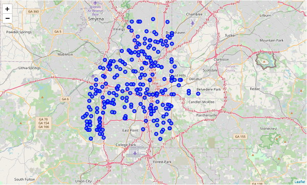
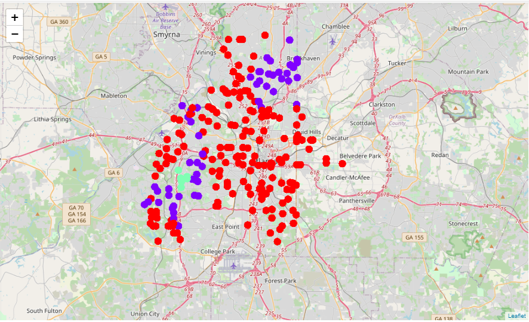
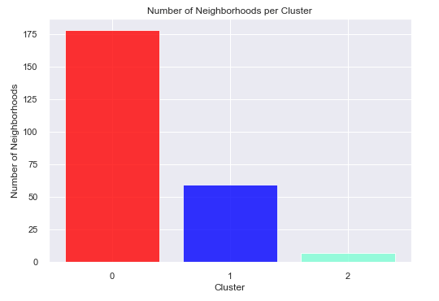
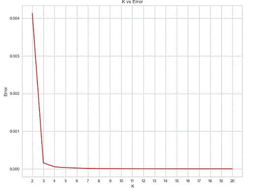

# Atlanta Arts and Entertainment Clustering

## Outcome

Clustered 244 Atlanta neighborhoods into three arts-and-entertainment access groups and found that 178 neighborhoods fell into the lowest-access cluster in the 2020 analysis.

## Role / Tools / Timeline

| Area | Details |
|---|---|
| Role | Data analysis, geospatial analysis, clustering, interpretation |
| Tools | Python, pandas, Folium, geopy, Foursquare API, K-means |
| Data vintage | 2020 historical analysis |
| Geography | Atlanta, Georgia |

## Business Question

Where are arts and entertainment venues concentrated across Atlanta neighborhoods, and which neighborhoods appear underserved relative to the rest of the city?

## Why It Matters

Arts and entertainment venues are part of a city's cultural infrastructure. Understanding where these venues concentrate can help planners, local organizations, and stakeholders identify geographic gaps, prioritize outreach, and communicate spatial inequities more clearly.

## Data Sources

- City of Atlanta neighborhood boundary and location data from regional open data.
- Foursquare venue data collected during the original 2020 analysis.
- Geocoding and mapping outputs generated with Python tools.

This is preserved as a historical 2020 analysis. The Foursquare API and access model have changed since the original project, so the current rebuild treats the results as a documented portfolio artifact rather than a freshly rerunnable live data pipeline.

## Methods

1. Built a neighborhood-level dataset for 244 Atlanta neighborhoods.
2. Retrieved nearby arts and entertainment venues by neighborhood.
3. Encoded venue categories into numerical features.
4. Aggregated category frequencies by neighborhood.
5. Used an elbow-method workflow to choose `k = 3`.
6. Applied K-means clustering to group neighborhoods by similar venue patterns.
7. Mapped the resulting clusters with Folium.

## Key Findings

- The clustering separated neighborhoods into three groups based on arts and entertainment venue frequency patterns.
- The largest cluster contained 178 of 244 neighborhoods and represented the lowest-access group in the original analysis.
- A small group of 7 neighborhoods had the highest mean venue frequency and was concentrated around central Atlanta.
- The result suggests strong spatial concentration rather than evenly distributed cultural access.

## Visual Evidence

{fig-alt="Map of Atlanta neighborhoods used in the geospatial analysis."}

{fig-alt="Map showing three clusters of Atlanta neighborhoods."}

{fig-alt="Chart showing the number of neighborhoods in each cluster."}

{fig-alt="Elbow chart used to select k equals three."}

## Interactive Maps

The original Folium maps are preserved as static HTML artifacts.

<iframe src="../assets/maps/atlanta/atl_map1.html" title="Atlanta neighborhood Folium map" class="project-map"></iframe>

<iframe src="../assets/maps/atlanta/atl_map2.html" title="Atlanta clustered neighborhood Folium map" class="project-map"></iframe>

## Technical Highlights

- Transformed nested API response data into an analysis-ready table.
- Used one-hot encoding to convert venue categories into numerical features.
- Aggregated venue category frequencies at the neighborhood level.
- Applied unsupervised learning to detect spatial patterns.
- Produced geospatial outputs that communicate the result visually.

## Limitations

- The Foursquare venue data reflects the original 2020 collection and may not represent current venue availability.
- Foursquare coverage can vary by neighborhood and by category.
- K-means requires a chosen number of clusters and can simplify complex spatial patterns.
- The original portfolio artifact preserved screenshots of code and tables; this rebuild should replace those with source notebooks or recreated code where possible.

## Reproducibility / How To Run

The original runnable notebook is not yet linked in this portfolio rebuild. Before final launch, the best improvement would be to recover the original notebook or recreate the workflow using a current open data source such as OpenStreetMap Overpass or Overture Maps.

For the MVP, this page should be framed as a historical analysis artifact with preserved maps, methods, and findings.

## Next Steps

- Recover or recreate the source notebook.
- Add a public GitHub repository link.
- Replace code and table screenshots with real code blocks and rendered tables.
- Consider rebuilding the project with current open venue data.
