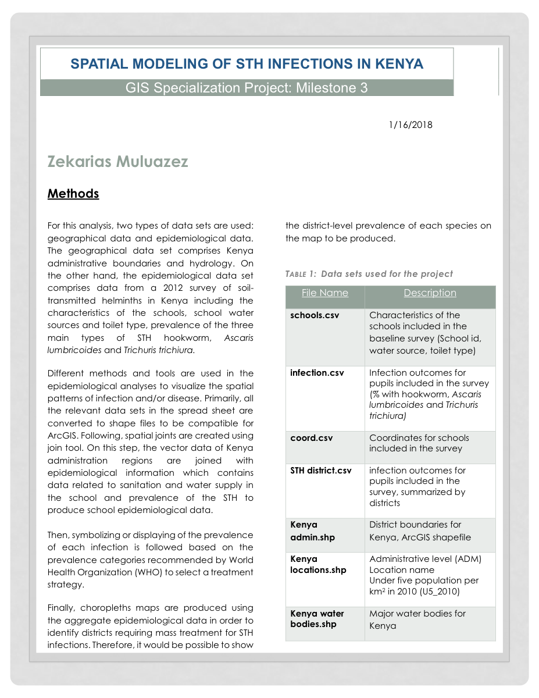

# Spatial Modeling of STH Infections in Kenya

## Outcome

Built an ArcGIS workflow to combine school survey, infection outcome, coordinate, district boundary, population, and hydrology data into choropleth maps for soil-transmitted helminth treatment planning in Kenya.

## Role / Tools / Timeline

| Area | Details |
|---|---|
| Role | Spatial data preparation, GIS joins, choropleth mapping, epidemiological interpretation |
| Tools | ArcGIS, shapefiles, CSV data, spatial joins, choropleth maps |
| Date | January 16, 2018 |
| Context | GIS Specialization capstone project, Milestone 3 |
| Geography | Kenya |
| Domain | Soil-transmitted helminth infection mapping |

## Public Artifact

- [Download the original PDF report](../assets/pdfs/sth-kenya.pdf)

{fig-alt="Cover page of the Spatial Modeling of STH Infections in Kenya report."}

## Research Question

How can school-level epidemiological survey data and geographic boundary data be combined to produce district-level maps of soil-transmitted helminth prevalence in Kenya?

## Why It Matters

Spatial modeling helps public health teams identify where infection prevalence is concentrated and where mass treatment strategies may be needed. In this project, prevalence categories follow World Health Organization treatment-planning logic, so the map output is intended to support decision-making rather than only visualization.

## Data Sources

The original report documents two broad data groups: geographical data and epidemiological data.

| File | Purpose |
|---|---|
| `schools.csv` | School characteristics from the baseline survey, including school ID, water source, and toilet type |
| `infection.csv` | Pupil infection outcomes for hookworm, *Ascaris lumbricoides*, and *Trichuris trichiura* |
| `coord.csv` | Coordinates for surveyed schools |
| `STH district.csv` | Survey infection outcomes summarized by district |
| `Kenya admin.shp` | Kenya district boundary shapefile |
| `Kenya locations.shp` | Administrative location data and under-five population per square kilometer |
| `Kenya water bodies.shp` | Major water bodies for Kenya |

## Methods

1. Converted relevant spreadsheet datasets into shapefiles compatible with ArcGIS.
2. Joined school-level epidemiological data to school coordinate data.
3. Joined Kenya administrative boundaries with epidemiological information.
4. Incorporated sanitation and water-supply attributes from the school survey.
5. Symbolized infection prevalence according to WHO prevalence categories.
6. Produced choropleth maps from aggregate epidemiological data to identify districts requiring mass treatment consideration.

## Key Outputs

- A documented GIS workflow for preparing public-health survey data for spatial analysis.
- District-level mapping logic for STH infection prevalence.
- A PDF report artifact that preserves the project methods and dataset inventory.

## Technical Highlights

- Combined tabular epidemiological data with geographic boundary data.
- Used spatial joins to connect school, district, and health-outcome records.
- Modeled three major STH infection types: hookworm, *Ascaris lumbricoides*, and *Trichuris trichiura*.
- Used choropleth mapping to communicate district-level prevalence patterns.

## Limitations

- The current portfolio has the final PDF artifact, not the original GIS project files.
- The PDF is treated as a historical project artifact from 2018.
- The case study should be expanded if the underlying ArcGIS files, source datasets, or exported maps are recovered.
- Without the full source project, this page documents the workflow and artifact rather than offering a fully reproducible GIS pipeline.

## Reproducibility / How To Run

The original ArcGIS project files are not currently included in this repo. To make this project reproducible, the next step would be to recover or recreate the source data package, document the spatial joins, and export the final map layers.

## Next Steps

- Recover the original ArcGIS project files or map exports if available.
- Add larger map images from the report or original GIS outputs.
- Document the exact prevalence classes used for treatment-planning categories.
- Add a short executive summary of the public health recommendation once the final map outputs are available for review.
